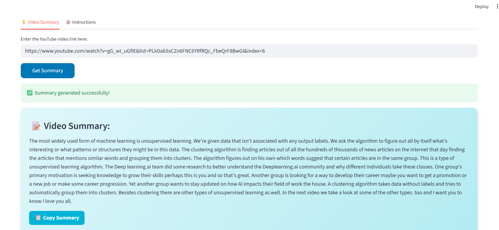

# YouTubeVideoSummarizer
# 🎬 YouTube Video Summarizer

An **end-to-end AI-powered YouTube video summarization system** using  
**FastAPI**, **Streamlit**, and **HuggingFace Transformers**.

---

## 📑 Table of Contents
- [Features](#-features)
- [Tech Stack](#-tech-stack)
- [Project Structure](#-project-structure)
- [Installation](#-installation)
- [Environment Variables](#-environment-variables)
- [Run the Project](#-run-the-project)
- [How It Works](#-how-it-works)
- [Screenshots](#-screenshots)
- [Author](#-author)

---

## 🚀 Features

- Summarize any YouTube video automatically

- Professional Streamlit UI (cards, tabs, gradients)

- Copy summary with one click

- REST API using FastAPI

- Secure API authentication

- Modular & production-ready architecture

---

## 🖥️ Tech Stack
| Layer      | Technology               |
| ---------- | ------------------------ |
| Frontend   | Streamlit                |
| Backend    | FastAPI, Uvicorn         |
| AI / NLP   | HuggingFace Transformers |
| Deployment | Ngrok                    |
| Language   | Python                   |

---

## 🗂️ Project Structure
Youtube Video Summarizer/
│
├── Frontend/
│   ├── __init__.py
│   └── app.py
│
├── Model_API/
│   ├── __init__.py
│   ├── Call_API.py
│   ├── Bart_Model
│   └── ngrok.py
│
├── screenshots/
│   ├── Instructions.png
│   ├── summary.png
│   └── Ui app.png
│
├── Utils/
│   ├── __init__.py
│   └── Get_Transcription.py
│
├── .gitignore
├── README.md
└── requirements.txt

---

## 📦 Installation
git clone https://github.com/HebaHossam68/YouTubeVideoSummarizer.git
cd "YouTube Video Summarizer"

# Create virtual environment:
python -m venv venv
venv\Scripts\activate      # Windows
source venv/bin/activate   # Linux / Mac

# Install dependencies:
pip install -r requirements.txt

---

## 🔑 Environment Variables
# Create a .env file:
API_KEY=your_api_key_here 
NGROK_URL=https://your-ngrok-url.ngrok-free.app

---

## ▶️ Run the Project
1️⃣ Run Backend (FastAPI)
uvicorn Model_API.ngrok:app --reload

2️⃣ Run Frontend (Streamlit)
streamlit run Frontend/app.py

---

## 🧠 How It Works
1- User enters a YouTube video URL

2- Transcript is extracted automatically

3- Text is sent to FastAPI backend

4- LLM generates a concise summary

5- Summary is displayed in Streamlit UI

---

## 📸 Screenshots

---

## 👩‍💻 Author
Heba Hossam
AI & Data Science Engineer

